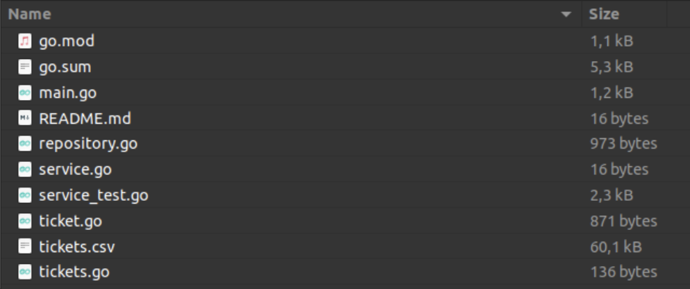

Bootcamp Go 
# Desafío Go Web💥


### Objetivo
El objetivo de esta guía práctica es poder afianzar y profundizar los conceptos vistos en Go Web. Para esto, vamos a plantear un desafío integrador que nos permitirá repasar los temas que estudiamos. 

### Planteo
Una aerolínea utiliza un programa para calcular diversas informaciones sobre vuelos que ocurren en la misma. Si bien su programa se encuentra funcional y sin dificultades, han decidido convertir el mismo en una API Rest.

¿Are you ready? 😎👍

---

### 💡 Desafío
Realizar un programa con arquitectura REST que sirva como herramienta para calcular diferentes datos estadísticos. Para lograrlo, debes clonar este repositorio donde encontrarás diversos archivos.



> 🔔 ¡Atención! El **repository.go** y **service_test.go** ya se encuentran desarrollados.

### 💡 Requerimiento 1: 
Crear los packages correspondientes para que la arquitectura de la aplicación cumpla con la definición de **REST y el Diseño Orientado a Dominio**.

> ❕ Tip: Los paquetes **internal** y **cmd** son fundamentales.

### 💡 Requerimiento 2: 
Ubicar los archivos de manera tal que cada uno quede en su respectivo package.

> ❕ Tip: Recordar chequear los **imports**.


### 💡 Requerimiento 3: 
Utilizando el archivo **service_test.go** como guía, desarrollar la lógica de negocio en **service.go**. Desarrollar los métodos correspondientes a la estructura **Ticket**. Uno de ellos debe devolver la cantidad de tickets de un destino. El  otro método debe devolver el **promedio** de personas que viajan a un país determinado en un dia:

> ❕ Tip: Intente recordar la definición de **TDD**.

> ❕ Tip 2: El **promedio de x** se calcula como: x̄ =  sum(x)/n 

### 💡 Requerimiento 4: 
Una vez desarrollado el servicio y el repositorio desarrollar el archivo **routes.go** en en el package que corresponda. Los endpoints deberán ser los siguientes:
```
GET - “/ticket/getByCountry/:dest”
GET - “/ticket/getAverage/:dest”
```

> ❕ Tip: El archivo routes.go **tiene su propio pkg**.

### 💡 Requerimiento 5: 
Correr el **main.go** y testear los endpoints con la herramienta de Postman.

> ❕ Tip: El comando **go mod tidy** puede ser necesario previo a correr el main.

> ❕ Tip 2: Desarrollar los **test** faltantes es un plus.g
